# UN Workflow Management System - Entity-Relationship Diagram

## Project Overview

The UN Workflow Management System manages bureaucratic operations across 6 principal organs:
- **GA** - General Assembly
- **SC** - Security Council
- **ECOSOC** - Economic and Social Council
- **ICJ** - International Court of Justice
- **SEC** - Secretariat
- **TC** - Trusteeship Council

---

## Mermaid ER Diagram (21 Entities)

```mermaid
erDiagram
    UN_ORGAN {
        int organ_id PK
        varchar organ_code UK
        varchar organ_name
        text organ_description
        int established_year
        varchar headquarters_location
        boolean is_active
    }

    MEMBER_STATE {
        int state_id PK
        varchar state_code UK
        varchar state_name
        varchar region
        date admission_date
        boolean is_sc_permanent_member
        decimal contribution_percentage
    }

    ROLE {
        int role_id PK
        varchar role_code UK
        varchar role_name
        text role_description
        int permission_level
        boolean can_approve
        boolean can_vote
        boolean can_issue_resolution
    }

    DEPARTMENT {
        int department_id PK
        varchar department_code UK
        varchar department_name
        varchar head_title
        date established_date
        int parent_department_id FK
    }

    OFFICER {
        int officer_id PK
        varchar employee_number UK
        varchar first_name
        varchar last_name
        varchar email UK
        int role_id FK
        int department_id FK
        int organ_id FK
        date hire_date
        varchar employment_status
        int security_clearance_level
    }

    DELEGATE {
        int delegate_id PK
        varchar delegate_code UK
        varchar first_name
        varchar last_name
        varchar title
        int state_id FK
        int organ_id FK
        date credential_date
        date credential_expiry_date
        boolean is_permanent_representative
        boolean voting_authority
    }

    MATTER {
        int matter_id PK
        varchar matter_number UK
        varchar title
        text description
        varchar matter_type
        int organ_id FK
        int submitted_by_delegate_id FK
        int submitted_by_officer_id FK
        varchar priority
        varchar status
        date submission_date
        varchar session_number
        boolean requires_voting
        decimal voting_threshold
    }

    MATTER_WORKFLOW {
        int workflow_id PK
        int matter_id FK
        int stage_number
        varchar stage_name
        varchar stage_status
        int assigned_officer_id FK
        datetime started_at
        datetime completed_at
    }

    APPROVAL {
        int approval_id PK
        int matter_id FK
        int approver_officer_id FK
        int approval_level
        varchar approval_status
        datetime decision_date
        text comments
    }

    VOTE {
        int vote_id PK
        int matter_id FK
        int state_id FK
        int delegate_id FK
        varchar vote_value
        datetime vote_timestamp
        boolean is_valid
    }

    RESOLUTION {
        int resolution_id PK
        varchar resolution_number UK
        int matter_id FK
        int organ_id FK
        varchar title
        text preamble
        text operative_text
        date adoption_date
        int yes_votes
        int no_votes
        int abstentions
        boolean is_binding
        varchar status
    }

    ICJ_JUDGE {
        int judge_id PK
        varchar judge_code UK
        varchar first_name
        varchar last_name
        int nationality_state_id FK
        date appointment_date
        date term_end_date
        boolean is_president
        boolean is_vice_president
        varchar specialization
        varchar status
    }

    ICJ_CASE {
        int case_id PK
        varchar case_number UK
        varchar case_title
        varchar case_type
        int applicant_state_id FK
        int respondent_state_id FK
        int requesting_organ_id FK
        date filing_date
        text subject_matter
        varchar status
    }

    ICJ_HEARING {
        int hearing_id PK
        int case_id FK
        int hearing_number
        varchar hearing_type
        date scheduled_date
        date actual_date
        int presiding_judge_id FK
        varchar status
        boolean transcript_available
    }

    ICJ_JUDGMENT {
        int judgment_id PK
        varchar judgment_number UK
        int case_id FK
        varchar judgment_type
        date judgment_date
        text summary
        int votes_in_favor
        int votes_against
        boolean is_unanimous
        boolean binding_on_parties
        varchar compliance_status
    }

    ICJ_CASE_JUDGE {
        int case_id FK
        int judge_id FK
        boolean is_ad_hoc
        date assigned_date
    }

    DIRECTIVE {
        int directive_id PK
        varchar directive_number UK
        varchar directive_type
        varchar title
        text content
        int issuing_department_id FK
        int target_department_id FK
        int issued_by_officer_id FK
        date issue_date
        date effective_date
        date expiry_date
        varchar priority
        varchar status
        boolean requires_acknowledgment
        int matter_id FK
    }

    DIRECTIVE_ACKNOWLEDGMENT {
        int acknowledgment_id PK
        int directive_id FK
        int officer_id FK
        datetime acknowledged_at
    }

    TRUSTEESHIP_TERRITORY {
        int territory_id PK
        varchar territory_code UK
        varchar territory_name
        int administering_state_id FK
        date trust_agreement_date
        date independence_date
        varchar current_status
        int population_at_trust
        decimal area_sq_km
    }

    TRUSTEESHIP_REPORT {
        int report_id PK
        varchar report_number UK
        int territory_id FK
        varchar report_type
        int report_year
        int reporting_officer_id FK
        date submission_date
        varchar review_status
        text findings
        text recommendations
        text decision
        date decision_date
    }

    AUDIT_LOG {
        int log_id PK
        varchar table_name
        int record_id
        varchar action_type
        text action_description
        json old_values
        json new_values
        int performed_by_officer_id FK
        int performed_by_delegate_id FK
        varchar ip_address
        datetime action_timestamp
    }

    %% ===== RELATIONSHIPS =====

    %% Core Organization
    UN_ORGAN ||--o{ MATTER : "receives"
    UN_ORGAN ||--o{ OFFICER : "employs"
    UN_ORGAN ||--o{ DELEGATE : "hosts"
    UN_ORGAN ||--o{ RESOLUTION : "adopts"

    %% Member State relationships
    MEMBER_STATE ||--o{ DELEGATE : "sends"
    MEMBER_STATE ||--o{ VOTE : "casts"
    MEMBER_STATE ||--o{ ICJ_JUDGE : "nationality"
    MEMBER_STATE ||--o{ TRUSTEESHIP_TERRITORY : "administers"

    %% ICJ Case parties
    MEMBER_STATE ||--o{ ICJ_CASE : "applicant"
    MEMBER_STATE ||--o{ ICJ_CASE : "respondent"

    %% Role assignment
    ROLE ||--o{ OFFICER : "assigned_to"

    %% Department hierarchy
    DEPARTMENT ||--o{ DEPARTMENT : "parent_of"
    DEPARTMENT ||--o{ OFFICER : "employs"
    DEPARTMENT ||--o{ DIRECTIVE : "issues"

    %% Matter workflow
    MATTER ||--o{ MATTER_WORKFLOW : "has_stages"
    MATTER ||--o{ APPROVAL : "requires"
    MATTER ||--o{ VOTE : "voted_on"
    MATTER ||--|{ RESOLUTION : "produces"

    %% Submitters
    DELEGATE ||--o{ MATTER : "submits"
    OFFICER ||--o{ MATTER : "submits"

    %% Workflow & Approvals
    OFFICER ||--o{ MATTER_WORKFLOW : "assigned_to"
    OFFICER ||--o{ APPROVAL : "approves"

    %% Voting
    DELEGATE ||--o{ VOTE : "cast_by"

    %% ICJ
    ICJ_CASE ||--o{ ICJ_HEARING : "has"
    ICJ_CASE ||--o{ ICJ_JUDGMENT : "results_in"
    ICJ_CASE ||--o{ ICJ_CASE_JUDGE : "assigned"
    ICJ_JUDGE ||--o{ ICJ_CASE_JUDGE : "sits_on"
    ICJ_JUDGE ||--o{ ICJ_HEARING : "presides"
    UN_ORGAN ||--o{ ICJ_CASE : "requests_advisory"

    %% Directives
    OFFICER ||--o{ DIRECTIVE : "issues"
    DIRECTIVE ||--o{ DIRECTIVE_ACKNOWLEDGMENT : "acknowledged_by"
    OFFICER ||--o{ DIRECTIVE_ACKNOWLEDGMENT : "acknowledges"
    MATTER ||--o{ DIRECTIVE : "linked_to"

    %% Trusteeship
    TRUSTEESHIP_TERRITORY ||--o{ TRUSTEESHIP_REPORT : "reported_on"
    OFFICER ||--o{ TRUSTEESHIP_REPORT : "reports"

    %% Audit
    OFFICER ||--o{ AUDIT_LOG : "performed_by"
    DELEGATE ||--o{ AUDIT_LOG : "performed_by"
```



## Relationship Summary Table

| # | Relationship | Type | From | To | Cardinality |
|---|---|---|---|---|---|
| 1 | Organ has Matters | 1:N | UN_ORGAN | MATTER | One organ → Many matters |
| 2 | Organ employs Officers | 1:N | UN_ORGAN | OFFICER | One organ → Many officers |
| 3 | Organ hosts Delegates | 1:N | UN_ORGAN | DELEGATE | One organ → Many delegates |
| 4 | Organ adopts Resolutions | 1:N | UN_ORGAN | RESOLUTION | One organ → Many resolutions |
| 5 | State sends Delegates | 1:N | MEMBER_STATE | DELEGATE | One state → Many delegates |
| 6 | State casts Votes | 1:N | MEMBER_STATE | VOTE | One state → Many votes |
| 7 | State has ICJ Judges | 1:N | MEMBER_STATE | ICJ_JUDGE | One state → Many judges |
| 8 | State administers Territories | 1:N | MEMBER_STATE | TRUSTEESHIP_TERRITORY | One state → Many territories |
| 9 | State is Applicant | 1:N | MEMBER_STATE | ICJ_CASE | One state → Many cases |
| 10 | State is Respondent | 1:N | MEMBER_STATE | ICJ_CASE | One state → Many cases |
| 11 | Role assigned to Officers | 1:N | ROLE | OFFICER | One role → Many officers |
| 12 | Department has Sub-depts | 1:N | DEPARTMENT | DEPARTMENT | Self-referencing hierarchy |
| 13 | Department employs Officers | 1:N | DEPARTMENT | OFFICER | One dept → Many officers |
| 14 | Matter has Workflow stages | 1:N | MATTER | MATTER_WORKFLOW | One matter → Many stages |
| 15 | Matter requires Approvals | 1:N | MATTER | APPROVAL | One matter → Many approvals |
| 16 | Matter receives Votes | 1:N | MATTER | VOTE | One matter → Many votes |
| 17 | Matter produces Resolution | 1:1 | MATTER | RESOLUTION | One matter → One resolution |
| 18 | Delegate submits Matters | 1:N | DELEGATE | MATTER | One delegate → Many matters |
| 19 | Officer submits Matters | 1:N | OFFICER | MATTER | One officer → Many matters |
| 20 | ICJ Case has Hearings | 1:N | ICJ_CASE | ICJ_HEARING | One case → Many hearings |
| 21 | ICJ Case has Judgments | 1:N | ICJ_CASE | ICJ_JUDGMENT | One case → Many judgments |
| 22 | ICJ Case ↔ Judge (M:N) | M:N | ICJ_CASE | ICJ_JUDGE | Via ICJ_CASE_JUDGE junction |
| 23 | Directive has Acknowledgments | 1:N | DIRECTIVE | DIRECTIVE_ACKNOWLEDGMENT | One directive → Many acks |
| 24 | Territory has Reports | 1:N | TRUSTEESHIP_TERRITORY | TRUSTEESHIP_REPORT | One territory → Many reports |

## Key Constraints

| Constraint | Table | Description |
|---|---|---|
| `chk_submitter` | MATTER | `submitted_by_delegate_id` OR `submitted_by_officer_id` must be set (XOR) |
| `chk_voting_threshold_range` | MATTER | `voting_threshold` BETWEEN 50 AND 100 |
| `uk_matter_state_vote` | VOTE | UNIQUE(`matter_id`, `state_id`) — one vote per state per matter |
| `uk_directive_officer_ack` | DIRECTIVE_ACKNOWLEDGMENT | UNIQUE(`directive_id`, `officer_id`) — one ack per officer per directive |
| `uk_case_judge` | ICJ_CASE_JUDGE | UNIQUE(`case_id`, `judge_id`) — one assignment per case-judge pair |
| `uk_hearing_number` | ICJ_HEARING | UNIQUE(`case_id`, `hearing_number`) — unique hearing per case |
| `CASCADE DELETE` | MATTER_WORKFLOW, APPROVAL, VOTE | Deleting a matter cascades to workflow, approvals, and votes |

---

## Detailed Entity Diagrams (Chen Notation)

## PART 1: CORE ORGANIZATIONAL ENTITIES

```
┌──────────────────────────────────────────────────────────────────────────────┐
│                    CORE ORGANIZATIONAL STRUCTURE                              │
└──────────────────────────────────────────────────────────────────────────────┘


                    ┌──────────────────────────┐
                    │      MEMBER_STATE        │
                    │      (Countries)         │
                    ├──────────────────────────┤
                    │ PK: state_id             │
                    │ UK: state_code (ISO)     │
                    │ • state_name             │
                    │ • region                 │
                    │ • admission_date         │
                    │ • is_sc_permanent_member │
                    │ • contribution_percentage│
                    └────────┬────────────────┘
                             │
              ┌──────────────┼──────────────┐
              │              │              │
              │ 1:N      1:N │          1:N │
              │              │              │
        ◇─────┴──────  ◇──────┴────  ◇───────┴──────
        │HAS_DELEGATES │HAS_JUDGES  │ VOTES_ON
        │              │            │
        ▼              ▼            ▼
    ┌─────────┐  ┌───────────┐  ┌────────┐
    │DELEGATE │  │ICJ_JUDGE  │  │ VOTE   │
    │         │  │           │  │        │
    │PK:del_id│  │PK:judge_id│  │PK:v_id │
    │FK:state │  │FK:state   │  │FK:matter
    │FK:organ │  │FK:term... │  │FK:delg
    │         │  │           │  │• value │
    │• title  │  │• specialty│  │• weight│
    │• creds  │  │• is_pres  │  └────────┘
    │• auth   │  │           │
    └────┬────┘  └─────┬─────┘
         │              │
         │ 1:N      1:N │
         │              │
    ◇────┴─────  ◇──────┴─────
    │SUBMITS      │ASSIGNED_TO
    │             │
    │        ┌────────────────────┐
    │        │  UN_ORGAN          │
    │        │  (6 Principal)     │
    │        ├────────────────────┤
    │        │ PK: organ_id       │
    │        │ UK: organ_code     │
    │        │ • organ_name       │
    │        │ • established_year │
    │        │ • headquarters     │
    │        └────┬───────────────┘
    │             │
    │             │ 1:N
    │        ◇────┴─────────
    │        │STAFFS_WITH
    │        │
    │        ▼
    │    ┌─────────────┐          ┌─────────┐
    │    │  OFFICER    │◄────1:N──┤  ROLE   │
    │    │  (Staff)    │       HAS│         │
    │    ├─────────────┤  ROLE    ├─────────┤
    │    │PK:officer_id           │PK: r_id │
    │    │FK:organ_id             │• r_code │
    │    │FK:role_id              │• r_name │
    │    │FK:dept_id              │• perms  │
    │    │• hire_date  │          │• level  │
    │    │• clearance  │          └─────────┘
    │    └────┬───────┘
    │         │
    │         │ 1:N
    │    ◇────┴──────────
    │    │ WORKS_IN
    │    │
    │    ▼
    │ ┌──────────────┐
    │ │ DEPARTMENT   │ (self-referencing 1:N for hierarchy)
    │ │ (Secretariat)│
    │ ├──────────────┤
    │ │ PK: dept_id  │
    │ │ FK: parent_id◄──┐ (parent-child hierarchy)
    │ │• dept_name   │  │
    │ │• dept_code   │  │
    │ └──────────────┘  │
    │ └──────────────────┘
    │
    └─► SUBMITS MATTER
         (Multiple officers/delegates submit matters)
```

---

## PART 2: MATTER PROCESSING & APPROVAL WORKFLOW

```
┌──────────────────────────────────────────────────────────────────────────────┐
│                 MATTER SUBMISSION, APPROVAL & VOTING                          │
└──────────────────────────────────────────────────────────────────────────────┘


                     ┌───────────────────────────┐
                     │      MATTER               │
                     │   (Main Business Entity)  │
                     ├───────────────────────────┤
                     │ PK: matter_id             │
                     │ FK: organ_id              │
                     │ FK: delegate_id (opt)     │
                     │ FK: officer_id (opt)      │
                     │ • matter_number (UK)      │
                     │ • matter_type             │
                     │ • priority                │
                     │ • status                  │
                     │ • requires_voting         │
                     │ • voting_threshold        │
                     │ • submission_date         │
                     │ • target_comp_date        │
                     │ • actual_comp_date        │
                     └────────┬────────────┬─────┘
                              │            │
                              │ 1:N        │ 1:N
                              │            │
                    ◇─────────┴───────  ◇──┴─────────
                    │HAS_WORKFLOW_STAGES │REQUIRES_APPROVALS
                    │                    │
                    ▼                    ▼
                ┌──────────────┐     ┌──────────────┐
                │MATTER_       │     │APPROVAL      │
                │WORKFLOW      │     │              │
                │              │     │PK:approval_id│
                │PK:workflow_id│     │FK:matter_id  │
                │FK:matter_id  │     │FK:officer_id │
                │FK:officer_id │     │• level       │
                │• stage_num   │     │• status      │
                │• stage_name  │     │• decision_   │
                │• status      │     │  date        │
                │• dates       │     │• comments    │
                └──────────────┘     └──────────────┘
                
                
                     ┌─────────────────┐
                     │    MATTER       │ (Status: IN_VOTING)
                     │   HAS VOTES     │
                     └────────┬────────┘
                              │
                              │ 1:N
                    ◇─────────┴──────
                    │ COLLECTED_FROM_STATES
                    │
                    ▼
                ┌────────────┐
                │ VOTE       │ ◄────── Cardinality: UK(matter_id, state_id)
                │            │         One vote per state per matter
                │PK: vote_id │
                │FK: matter  │
                │FK: delegate│
                │FK: state   │
                │• value     │
                │• weight    │
                │• is_valid  │
                └─────┬──────┘
                      │
                      └─► Vote counting determines outcome
                      
                      
                     ┌──────────────────┐
                     │RESOLUTION        │ ◄──── 1:1 (if voting passes)
                     │(Outcome)         │
                     ├──────────────────┤
                     │PK: res_id        │
                     │FK: matter_id (UK)│
                     │FK: organ_id      │
                     │• res_number (UK) │
                     │• title           │
                     │• preamble        │
                     │• operative_text  │
                     │• yes_votes       │
                     │• no_votes        │
                     │• abstentions     │
                     │• adoption_date   │
                     │• is_binding      │
                     │• implementation  │
                     │• status          │
                     └──────────────────┘
```

---

## PART 3: DIRECTIVE MANAGEMENT & ACKNOWLEDGMENT

```
┌──────────────────────────────────────────────────────────────────────────────┐
│                    SECRETARIAT DIRECTIVES & TRACKING                          │
└──────────────────────────────────────────────────────────────────────────────┘


              ┌──────────────────┐
              │DEPARTMENT        │ (issuing)
              │(Secretariat)     │
              └────────┬─────────┘
                       │
                       │ 1:N
                  ◇────┴─────
                  │ ISSUES
                  │
                  ▼
              ┌──────────────────────┐
              │DIRECTIVE             │
              │(Circulars/Policies)  │
              ├──────────────────────┤
              │PK: directive_id      │
              │FK: issuing_dept_id   │
              │FK: target_dept_id(opt)
              │FK: issued_by_officer │
              │FK: matter_id (opt)   │
              │• directive_number(UK)│
              │• directive_type      │
              │• title               │
              │• content             │
              │• issue_date          │
              │• effective_date      │
              │• expiry_date (opt)   │
              │• priority            │
              │• status              │
              │• requires_ack        │
              └───────┬──────────────┘
                      │
                      │ 1:N
                 ◇────┴─────────
                 │ ACKNOWLEDGED_BY
                 │
                 ▼
             ┌─────────────────────┐
             │DIRECTIVE_           │
             │ACKNOWLEDGMENT       │
             ├─────────────────────┤
             │PK: ack_id           │
             │FK: directive_id     │
             │FK: officer_id       │
             │UK:(directive, officer)
             │• acknowledged_at    │
             │• notes              │
             └─────────────────────┘
```

---

## PART 4: INTERNATIONAL COURT OF JUSTICE (ICJ)

```
┌──────────────────────────────────────────────────────────────────────────────┐
│                          ICJ CASE MANAGEMENT                                  │
└──────────────────────────────────────────────────────────────────────────────┘


                  ┌──────────────────────────┐
                  │     ICJ_CASE             │
                  │ (Contentious/Advisory)   │
                  ├──────────────────────────┤
                  │ PK: case_id              │
                  │ FK: applicant_state_id   │
                  │ FK: respondent_state_id  │
                  │ FK: requesting_organ_id  │
                  │ FK: matter_id (optional) │
                  │ • case_number (UK)       │
                  │ • case_title             │
                  │ • case_type              │
                  │ • filing_date            │
                  │ • subject_matter         │
                  │ • status                 │
                  └───────┬──────────┬──────┬────────┘
                          │          │      │
                    1:N   │     1:N  │  M:N │
                          │          │      │
                ◇─────────┴────  ◇────┴──  ◇┴──────────
                │HAS_HEARINGS    │HAS_JUDGES
                │                │(M:N via
                │                │ ICJ_CASE_JUDGE)
                │                │
                ▼                ▼
            ┌─────────────┐  ┌──────────────────┐
            │ICJ_HEARING  │  │ICJ_CASE_JUDGE    │
            │             │  │(Junction Table)  │
            │PK:hearing_id│  ├──────────────────┤
            │FK:case_id   │  │PK: case_judge_id │
            │FK:judge_id  │  │FK: case_id       │
            │• h_number   │  │FK: judge_id      │
            │• h_type     │  │UK:(case, judge)  │
            │• sched_date │  │• is_ad_hoc       │
            │• actual_date│  │• appointed_by_   │
            │• location   │  │  state_id (opt)  │
            │• status     │  └────────┬─────────┘
            │• transcript │           │
            │• notes      │           │ FK
            └─────────────┘           │
                                      ▼
                                  ┌─────────────┐
                                  │ICJ_JUDGE    │
                                  │(15 judges)  │
                                  ├─────────────┤
                                  │PK: judge_id │
                                  │FK: nation_  │
                                  │   state_id  │
                                  │• judge_code │
                                  │• first_name │
                                  │• last_name  │
                                  │• special.   │
                                  │• is_pres    │
                                  │• is_v_pres  │
                                  │• term_end   │
                                  │• status     │
                                  └─────────────┘
                
                ┌──────────────────────┐
                │ICJ_JUDGMENT          │
                │(Court Decisions)     │
                ├──────────────────────┤
                │PK: judgment_id       │
                │FK: case_id           │
                │• judgment_number(UK) │
                │• judgment_type       │
                │• judgment_date       │
                │• summary             │
                │• full_text           │
                │• votes_in_favor      │
                │• votes_against       │
                │• is_unanimous        │
                │• binding_on_parties  │
                │• compliance_status   │
                └──────────────────────┘
```

---

## PART 5: TRUSTEESHIP COUNCIL (HISTORICAL)

```
┌──────────────────────────────────────────────────────────────────────────────┐
│                    TRUSTEESHIP OVERSIGHT DOMAIN                               │
└──────────────────────────────────────────────────────────────────────────────┘


    ┌──────────────────────────┐
    │TRUSTEESHIP_TERRITORY     │
    │(Trust Territories)       │
    ├──────────────────────────┤
    │PK: territory_id          │
    │FK: administering_state_id│
    │• territory_code (UK)     │
    │• territory_name          │
    │• trust_agreement_date    │
    │• independence_date       │
    │• current_status          │
    │• population              │
    │• area_sq_km              │
    └────────┬─────────────────┘
             │
             │ 1:N
         ◇───┴──────────
         │ SUBJECT_OF
         │
         ▼
     ┌──────────────────────┐
     │TRUSTEESHIP_REPORT    │
     │(Oversight Reports)   │
     ├──────────────────────┤
     │PK: report_id         │
     │FK: territory_id      │
     │FK: officer_id        │
     │FK: matter_id (opt)   │
     │• report_number (UK)  │
     │• report_type         │
     │• report_year         │
     │• submission_date     │
     │• review_status       │
     │• findings            │
     │• recommendations     │
     │• decision            │
     │• decision_date       │
     └──────────────────────┘
```

---

## PART 6: AUDIT TRAIL (SYSTEM-WIDE)

```
┌──────────────────────────────────────────────────────────────────────────────┐
│                   COMPLETE AUDIT LOG (All Changes)                            │
└──────────────────────────────────────────────────────────────────────────────┘


                    ┌────────────────────────┐
                    │AUDIT_LOG               │
                    │(System Audit Trail)    │
                    ├────────────────────────┤
                    │PK: log_id              │
                    │FK: performed_by_officer│ (optional)
                    │FK: performed_by_       │ (optional)
                    │   delegate             │
                    │• table_name            │
                    │• record_id             │
                    │• action_type           │
                    │• action_description    │
                    │• old_values (JSON)     │
                    │• new_values (JSON)     │
                    │• ip_address            │
                    │• user_agent            │
                    │• action_timestamp      │
                    └────────┬───────────────┘
                             │
                    ┌────────┴──────────┐
                    │                   │
                    │ 1:N              │ 1:N
            ◇───────┴────────  ◇────────┴────────
            │ LOGGED_BY        │ LOGGED_BY
            │ OFFICER          │ DELEGATE
            │                  │
            ▼                  ▼
        (OFFICER)           (DELEGATE)

Tracks changes to:
• MATTER (INSERT, UPDATE, STATUS_CHANGE, DELETE)
• VOTE (VOTE action)
• APPROVAL (APPROVAL action)
• RESOLUTION
• ICJ_CASE (status changes)
• DIRECTIVE (changes)
```

---

## Relationship Summary Table

| Entity A | Relationship | Entity B | Cardinality | Notes |
|----------|-------------|----------|-------------|-------|
| MEMBER_STATE | has | DELEGATE | 1:N | Countries send delegates |
| MEMBER_STATE | appoints | ICJ_JUDGE | 1:N | Judges from countries |
| MEMBER_STATE | casts | VOTE | 1:N | States vote on matters |
| UN_ORGAN | staffs | OFFICER | 1:N | Officers work for organs |
| UN_ORGAN | receives | DELEGATE | 1:N | Delegates in organs |
| UN_ORGAN | processes | MATTER | 1:N | Organs process matters |
| ROLE | defines | OFFICER | 1:N | Officers have roles |
| DEPARTMENT | manages | OFFICER | 1:N | Officers in departments |
| DEPARTMENT | hierarchy | DEPARTMENT | 1:N | Self-referencing parent-child |
| DEPARTMENT | issues | DIRECTIVE | 1:N | Departments issue directives |
| OFFICER | submits | MATTER | 1:N | Officers submit matters |
| OFFICER | approves | APPROVAL | 1:N | Officers approve matters |
| OFFICER | oversees | MATTER_WORKFLOW | 1:N | Officers manage workflow |
| OFFICER | issues | DIRECTIVE | 1:N | Officers issue directives |
| OFFICER | logs | AUDIT_LOG | 1:N | Officer actions audited |
| DELEGATE | submits | MATTER | 1:N | Delegates submit matters |
| DELEGATE | casts | VOTE | 1:N | Delegates cast votes |
| DELEGATE | logs | AUDIT_LOG | 1:N | Delegate actions audited |
| MATTER | has | MATTER_WORKFLOW | 1:N | Matter has workflow stages |
| MATTER | requires | APPROVAL | 1:N | Matter needs approvals |
| MATTER | receives | VOTE | 1:N | Matter gets voted on |
| MATTER | becomes | RESOLUTION | 1:1 | Passed matter → resolution |
| MATTER | relates_to | ICJ_CASE | 1:1 | Optional link |
| MATTER | relates_to | DIRECTIVE | 1:1 | Optional link |
| MATTER | relates_to | TRUSTEESHIP_REPORT | 1:1 | Optional link |
| ICJ_CASE | has | ICJ_HEARING | 1:N | Case has hearings |
| ICJ_CASE | has | ICJ_JUDGMENT | 1:N | Case produces judgments |
| ICJ_CASE | assigns | ICJ_JUDGE | M:N | Multiple judges via ICJ_CASE_JUDGE |
| ICJ_JUDGE | presides | ICJ_HEARING | 1:N | Judge presides over hearings |
| DIRECTIVE | acknowledged_by | OFFICER | M:N | Multiple officers acknowledge via DIRECTIVE_ACKNOWLEDGMENT |
| TRUSTEESHIP_TERRITORY | subject_of | TRUSTEESHIP_REPORT | 1:N | Territory has reports |

---

## ER Diagram Notation Legend

```
┌────────────────┐
│    ENTITY      │  = Table/Entity (Rectangle)
│ (Attributes)   │
└────────────────┘

◇────────────────  = Relationship (Diamond notation with label)

─────────────────  = Connection between entities

1:N = One-to-Many relationship
1:1 = One-to-One relationship
M:N = Many-to-Many (uses junction table)

PK  = Primary Key (unique identifier)
FK  = Foreign Key (references another table)
UK  = Unique Key (alternative unique identifier)
(opt) = Optional/Nullable field

Cardinality shown on relationship lines:
  1:N  indicates one entity has many related entities
  M:N  indicates many-to-many (stored in junction table)
  1:1  indicates exactly one related entity
```

---

## Key Constraints & Integrity Rules

### UNIQUE Constraints
- MATTER.matter_number
- RESOLUTION.resolution_number (1:1 with MATTER)
- VOTE: (matter_id, state_id) — one vote per state per matter
- DIRECTIVE_ACKNOWLEDGMENT: (directive_id, officer_id) — one ack per officer
- ICJ_CASE_JUDGE: (case_id, judge_id) — one assignment per judge per case
- ICJ_HEARING: (case_id, hearing_number) — sequential hearings per case

### CHECK Constraints
- MEMBER_STATE.region: in predefined regions
- UN_ORGAN.organ_code: GA, SC, ECOSOC, ICJ, SEC, TC
- ROLE.permission_level: 1-10
- MATTER.voting_threshold: 50-100%
- OFFICER.security_clearance: 1-5

### CASCADE DELETE
- MATTER_WORKFLOW (when MATTER deleted)
- APPROVAL (when MATTER deleted)
- VOTE (when MATTER deleted)
- ICJ_HEARING (when ICJ_CASE deleted)
- DIRECTIVE_ACKNOWLEDGMENT (when DIRECTIVE deleted)

### Submitted By Validation
Either delegate OR officer submits matter, never both or neither

---

## Data Flow Example: Resolution Process

```
1. DELEGATE/OFFICER submits MATTER to UN_ORGAN
                              ↓
2. MATTER enters workflow: MATTER_WORKFLOW stages
                              ↓
3. Officers review & approve: APPROVAL chain
                              ↓
4. MATTER status → IN_VOTING
                              ↓
5. DELEGATES cast VOTE (one per state)
                              ↓
6. Vote counting determines passage
                              ↓
7. If passed → RESOLUTION created
                              ↓
8. All changes → AUDIT_LOG recorded
```
